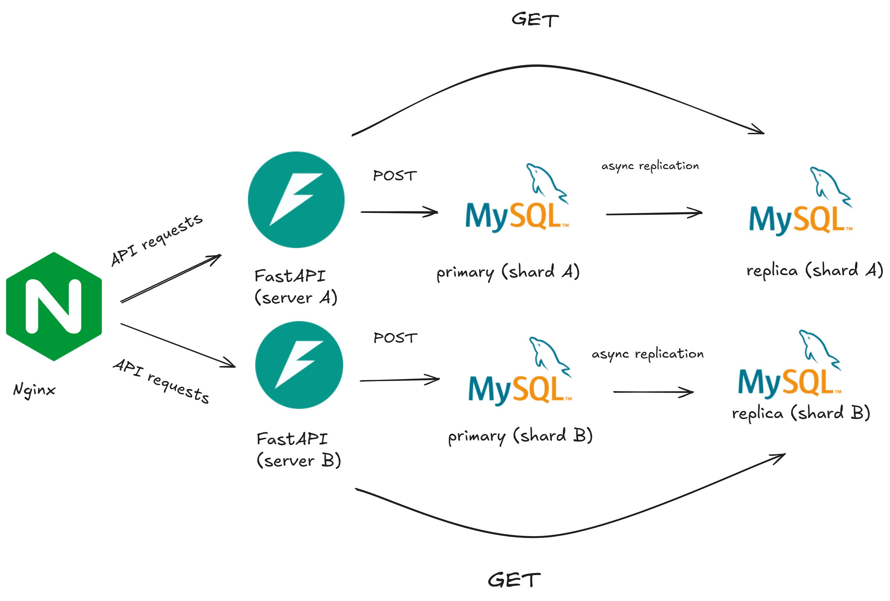
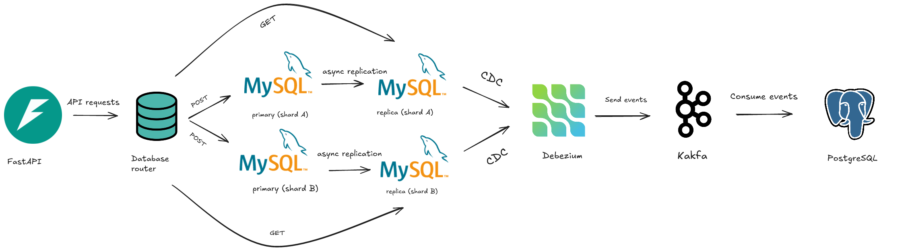

# MySQL Load Balancing and Replication with FastAPI

## Table of Contents
- [Overview](#overview)
- [Architecture](#architecture)
- [Implementation Details](#implementation-details)
  - [Load Balancer Setup](#load-balancer-setup)
  - [Read/Write Splitting](#readwrite-splitting)
  - [Testing and Verification](#testing-and-verification)
- [Testing Load Balancer and API Sharding](#testing-load-balancer-and-api-sharding)
  - [Setup and Testing Steps](#setup-and-testing-steps)
  - [Expected Results](#expected-results)
  - [Common Issues](#common-issues)
- [Common Docker Commands Reference](#common-docker-commands-reference)
  - [Container Management](#container-management)
  - [Image Management](#image-management)
  - [Docker Compose](#docker-compose)
  - [System Management](#system-management)
  - [Troubleshooting Commands](#troubleshooting-commands)
  - [Performance Monitoring](#performance-monitoring)
- [Glossary](#glossary)
- [Future Solutions and Improvements](#future-solutions-and-improvements)
  - [Current Architecture Limitations](#current-architecture-limitations)
  - [Alternative Approaches](#alternative-approaches)
    - [1. Sticky Sessions](#sticky-sessions)
    - [2. Consistent Hashing](#consistent-hashing)
    - [3. Business Logic Sharding](#business-logic-sharding)
  - [Considerations for Implementation](#considerations-for-implementation)

## Overview
This project is a continuation of the previous project, but with added features: 
1. Load balancing FastAPI instances with Nginx
2. MySQL master-replica replication
3. Read/write splitting between master and replica

Some of the code is adapted from the previous project, but I've added a lot of new code to implement the new features. In addition I've limited the scope of the project to only include the new features, and removed the parts that are not relevant to the new features. This means there will not anything related to the Debezium/Kafka CDC pipeline or the PostgreSQL database. 

The prior repository can be found [here](https://github.com/Shogun89/cdc_kafka_debezium) along with the Substack article [here](https://open.substack.com/pub/invariantsubspace/p/exploring-cdc-with-kafka-and-debezium?r=4l2b0p&utm_campaign=post&utm_medium=web).

## Architecture
The architecture is as follows: 
- Nginx load balancer distributes requests between two FastAPI instances
- Each FastAPI instance connects to its own MySQL shard
- Each shard has a master (writes) and replica (reads)

I've included a diagram of the architecture below:



As an aside I had originally intended for this project to include a router from within the FastAPI instances to connect to the appropriate MySQL shard. However, I discovered this would be more trouble than it was worth, and would not be a good use of time. Instead I've included a simple load balancer in Nginx and I've gotten rid of the parts related to the Kafka/Debezium pipeline to keep the scope of the project manageable. This means the load balancer is not doing anything fancy, but it does its job. This architecture is also much simpler than the previous one, and easier to understand. You can see the architecture below



In addition you can see the docker compose file below:
```
services:
  nginx:
    image: nginx:latest
    ports:
      - "80:80"
    volumes:
      - ./nginx.conf:/etc/nginx/nginx.conf:ro
    depends_on:
      - api-a
      - api-b

  api-a:
    build:
      context: .
      dockerfile: Dockerfile.api
    container_name: api-a
    environment:
      - SHARD=a
    ports:
      - "8001:8000"
    depends_on:
      - mysql-master-a
      - mysql-replica-a

  api-b:
    build:
      context: .
      dockerfile: Dockerfile.api
    container_name: api-b
    environment:
      - SHARD=b
    ports:
      - "8002:8000"
    depends_on:
      - mysql-master-b
      - mysql-replica-b

  mysql-master-a:
    container_name: mysql-master-a
    image: mysql:8.0
    environment:
      MYSQL_ROOT_PASSWORD: rootpassword
      MYSQL_DATABASE: fastapi_db
    ports:
      - "3316:3306"
    command: >
      --default-authentication-plugin=mysql_native_password
      --server-id=1
      --log-bin=mysql-bin
      --binlog_format=ROW
      --gtid_mode=ON
      --enforce-gtid-consistency=ON
      --innodb-buffer-pool-size=1G

  mysql-replica-a:
    container_name: mysql-replica-a
    image: mysql:8.0
    environment:
      MYSQL_ROOT_PASSWORD: rootpassword
      MYSQL_DATABASE: fastapi_db
    ports:
      - "3317:3306"
    command: >
      --default-authentication-plugin=mysql_native_password
      --server-id=11
      --log-bin=mysql-bin
      --binlog_format=ROW
      --gtid_mode=ON
      --enforce-gtid-consistency=ON
      --read-only=1
      --relay-log=relay-bin
      --skip-slave-start=1
      --innodb-buffer-pool-size=1G

  mysql-master-b:
    container_name: mysql-master-b
    image: mysql:8.0
    environment:
      MYSQL_ROOT_PASSWORD: rootpassword
      MYSQL_DATABASE: fastapi_db
    ports:
      - "3326:3306"
    command: >
      --default-authentication-plugin=mysql_native_password
      --server-id=2
      --log-bin=mysql-bin
      --binlog_format=ROW
      --gtid_mode=ON
      --enforce-gtid-consistency=ON
      --innodb-buffer-pool-size=1G

  mysql-replica-b:
    container_name: mysql-replica-b
    image: mysql:8.0
    environment:
      MYSQL_ROOT_PASSWORD: rootpassword
      MYSQL_DATABASE: fastapi_db
    ports:
      - "3327:3306"
    command: >
      --default-authentication-plugin=mysql_native_password
      --server-id=21
      --log-bin=mysql-bin
      --binlog_format=ROW
      --gtid_mode=ON
      --enforce-gtid-consistency=ON
      --read-only=1
      --relay-log=relay-bin
      --skip-slave-start=1
      --innodb-buffer-pool-size=1G

  test:
    build:
      context: .
      dockerfile: Dockerfile.test
    depends_on:
      - nginx
      - api-a
      - api-b

networks:
  mysql-network:
    driver: bridge
```
## Implementation Details

### Load Balancer Setup
The Nginx load balancer is configured to distribute traffic across multiple FastAPI instances using a round-robin algorithm. That means each request will be sent to a different FastAPI instance each time. 

Here's the key implementation:

1. **Nginx Configuration**
```nginx
events {
    worker_connections 1024;
}

http {
    upstream backend {
        server api-a:8000;
        server api-b:8000;
    }

    server {
        listen 80;
        
        location / {
            proxy_pass http://backend;
            proxy_set_header Host $host;
            proxy_set_header X-Real-IP $remote_addr;
        }
    }
} 
```

2. **Docker Compose Integration**
```yaml
services:
  nginx:
    image: nginx:latest
    volumes:
      - ./nginx.conf:/etc/nginx/conf.d/default.conf
    ports:
      - "80:80"
    depends_on:
      - api1
      - api2
```


### Read/Write Splitting
The application implements database read/write splitting to optimize performance and distribute database load. That means each FastAPI instance will connect to its own MySQL shard, and the requests will be split between the master and replica databases. The write (insert/update/delete) requests will go to the master database, while the read (select) requests will go to the replica database.


1. **Connection Management**
- Write operations (INSERT, UPDATE, DELETE) are directed to the master database
- Read operations (SELECT) are directed to the replica database


2. **Key Benefits**
- Improved read performance through load distribution
- Enhanced write performance by dedicating master for write operations
- Better scalability and resource utilization
- Increased fault tolerance with automatic failover

# Testing Load Balancer and API Sharding

### Setup and Testing Steps
1. Start all services:
```bash
docker-compose up --build
```

2. Test load balancer round-robin:
```bash
# These requests should alternate between Shard A and B
curl http://localhost/docs
curl http://localhost/docs
```

3. Verify MySQL replication:
```bash
# Check master-a status
docker exec -it mysql-master-a mysql -uroot -prootpassword -e "SHOW MASTER STATUS\G"

# Check replica-a status
docker exec -it mysql-replica-a mysql -uroot -prootpassword -e "SHOW SLAVE STATUS\G"

# Check master-b status
docker exec -it mysql-master-b mysql -uroot -prootpassword -e "SHOW MASTER STATUS\G"

# Check replica-b status
docker exec -it mysql-replica-b mysql -uroot -prootpassword -e "SHOW SLAVE STATUS\G"
```

4. Test API endpoints:
```bash
# Create a user
curl -X 'POST' \
  'http://localhost/api/users/?replica=false' \
  -H 'accept: application/json' \
  -H 'Content-Type: application/json' \
  -d '{
  "email": "test2@example.com",
  "is_active": true
}'

# Get all users
curl http://localhost/api/users/?replica=false
```

### Expected Results
- Load balancer should distribute requests evenly between api-a and api-b
- MySQL replication should show proper master-replica configuration
- API requests should work through the load balancer
- Data should be properly stored and replicated

### Common Issues
- If services don't start, ensure ports are available
- If database connections fail, check environment variables
- If load balancer fails, verify nginx.conf is properly mounted

### Setup and Testing Steps
I've created a docker compose file that includes a load balancer, two FastAPI instances, and two MySQL shards with master-replica replication. Running the following command will start all services:

```bash
docker-compose up --build -d
```
The FastAPI instances will automatically start the database initialization and replication setup scripts, while the testing container will run the API tests and verify the load balancer and read/write splitting. This is all checked by a script which will output the results to the testing container's logs.

## Common Docker Commands Reference
### Container Management
```bash
# List running containers
docker ps

# List all containers (including stopped)
docker ps -a

# Stop a container
docker stop <container_id>

# Remove a container
docker rm <container_id>

# Start a container
docker start <container_id>

# View container logs
docker logs <container_id>
docker logs -f <container_id>  # Follow log output
```

### Image Management
```bash
# List images
docker images

# Remove an image
docker rmi <image_name>

# Pull an image
docker pull <image_name>

# Build an image
docker build -t <image_name> .
```

### Docker Compose
```bash
# Start services
docker compose up

# Start services in detached mode
docker compose up -d

# Stop services
docker compose down

# Rebuild and start services
docker compose up --build

# View service logs
docker compose logs
```

### Scale specific service
```bash
# Scale specific service
docker compose up --scale api=3
```

### System Management
```bash
# Remove unused data
docker system prune

# Remove all unused images
docker system prune -a

# Show docker disk usage
docker system df

# Show detailed disk usage
docker system df -v

# Remove all unused volumes
docker volume prune

# Show system-wide information
docker info
```

### Troubleshooting Commands
```bash
# Inspect container details
docker inspect <container_id>

# View container resource usage
docker stats

# Check container processes
docker top <container_id>

# View container network settings
docker network ls
docker network inspect <network_name>

# Debug container
docker exec -it <container_id> /bin/bash
```

### Performance Monitoring
```bash
# Monitor all containers
docker stats --all

# Monitor specific container
docker stats <container_id>

# Export container metrics
docker stats --format "table {{.Container}}\t{{.CPUPerc}}\t{{.MemUsage}}"

# Check container events
docker events
```

## Glossary
- **API**: Application Programming Interface. The API is the interface between the application and the database. FastAPI is used to create the API.
- **Asynchronous Programming**: Asynchronous programming is a programming paradigm that allows for non-blocking, event-driven execution of code. In this project, the replication is done asynchronously.
- **Binlog**: The binary log is a database log that records all changes to the database. In this project, the MySQL shards are configured to use the binlog to replicate the data to the replica.
- **Bufferpool**: The buffer pool is a cache of data blocks that are read from the database. The buffer pool is used to improve the performance of the database by reducing the number of disk reads.
- **Curl**: curl is a command-line tool for transferring data with URLs. In this project, it's used to test the API endpoints.
- **Database**: A structured system for storing, organizing, and retrieving data, which in this project is implemented using MySQL.
- **Docker**: Docker is used to containerize the application and services, providing a consistent and isolated environment that packages all dependencies and can run reliably across different computing environments.
- **Docker Compose**: Docker Compose is used to define and run the multi-container Docker application.
- **Dockerfile**: Dockerfile is a script that contains the instructions for building a Docker image. In this project, it's used to create the Docker image for the FastAPI instances and the testing container.
- **entrypoint**: The entrypoint is the command that is executed when the container starts. In this project, it's used to run the database initialization and replication setup scripts.
- **FastAPI**: FastAPI is the web framework used to create the API.
- **GET**: GET is a request method supported by HTTP used by the API to request data from a specified resource.
- **Load Balancer**: Nginx is used as a load balancer to distribute traffic between the two FastAPI instances.
- **Master**: Another term for the primary database. The primary database is used for write operations (INSERT, UPDATE, DELETE).
- **MySQL**: MySQL is an open-source relational database management system that serves as the backend database in this project, using SQL (Structured Query Language) for managing and querying data.
- **Replica**: The replica database is used for read operations (SELECT).
- **Nginx**: Nginx (pronounced "engine-x") is a powerful open-source web server, reverse proxy, and load balancer. As a web server, it can serve static content with high performance. As a reverse proxy, it sits in front of application servers (like our FastAPI instances) and forwards client requests to them. In our architecture, we're primarily using its load balancing capabilities to distribute incoming traffic across multiple FastAPI instances, which helps improve the application's scalability and reliability. Nginx is known for its high performance, stability, rich feature set, simple configuration, and low resource consumption.
- **POST**: POST is a request method supported by HTTP used by the API to create new resources.
- **Read/Write Splitting**: The application implements database read/write splitting to optimize performance and distribute database load. That means each FastAPI instance will connect to its own MySQL shard, and the requests will be split between the master and replica databases. The write (insert/update/delete) requests will go to the master database, while the read (select) requests will go to the replica database.
- **Replication**: Replication is the process of copying data from one database to another. In this project, the MySQL shards are replicated from the primary to the replica.
- **Round robin**: Round robin is a load balancing algorithm that distributes incoming requests evenly across a group of servers. In this project, Nginx is used to implement round robin load balancing to distribute traffic between the two FastAPI instances.
- **Shard**: A subset of the data that is stored in a database. Each MySQL shard has a master and replica.
- **Swagger UI**: Swagger UI is a tool that allows us to interact with the API and see the available endpoints and their documentation. It's a useful tool for testing and debugging the API.

## Future Solutions and Improvements

### Current Architecture Limitations
The current round-robin load balancing approach has potential issues:
- User data can be split across shards
- Queries need to check multiple shards
- No transaction guarantees across shards
- Inconsistent data state possible

### Alternative Approaches

#### 1. Sticky Sessions
```nginx
http {
    upstream backend {
        ip_hash;  # or hash $cookie_session
        server api-a:8000;
        server api-b:8000;
    }
}
```
- Routes same user to same API/shard
- Based on IP or session cookie
- Simple to implement
- Limited by IP changes or session expiration

#### 2. Consistent Hashing
```nginx
http {
    upstream backend {
        hash $http_x_user_email consistent;
        server api-a:8000;
        server api-b:8000;
    }
}
```
- Deterministic shard selection
- Based on user identifier
- Predictable and consistent
- Requires user info for routing

#### 3. Business Logic Sharding
```python
@app.middleware("http")
async def route_by_region(request: Request, call_next):
    region = request.headers.get("X-Region")
    if region == "US":
        # Route to US shard
    elif region == "EU":
        # Route to EU shard
```
- Sharding based on business rules
- E.g., geographical region, customer type
- Clear boundaries and logic
- More complex implementation

### Considerations for Implementation
- Data consistency requirements
- Query patterns and performance needs
- Business requirements and scaling plans
- Operational complexity trade-offs


